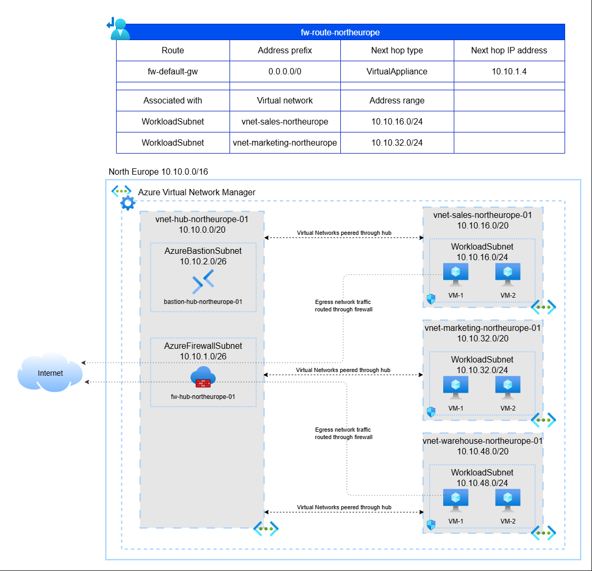

# Architecture

## Components

- **Azure Bastion**
    - Secure SSH/RDP access to workloads without exposing public IPs
- **Azure Network Manager**
    - Centralized management console for region wide virtual networks
- **Azure Virtual Network**
    - Hub-spoke private network separation. VNet - VNet communication goes through central VNet containing shared services
- **Azure Firewall**
    - Egress point for internet destined traffic from workloads. 
- **Azure Route Table**
    - Force egress traffic through Azure Firewall
- **Network Security Group**
    - Subnet level network rules, workload specific rules applied at NIC level

## Architecture Decision Records

Architectural decision records are recorded to preserve context of architectural choices. These will be written in the format proposed in a
[blog post by Michael Nygard](http://thinkrelevance.com/blog/2011/11/15/documenting-architecture-decisions)

List of ADRs are in [architecture-decisions-records directory](architecture-decision-records/).

### Tooling

[adr-tools](https://github.com/npryce/adr-tools) is used to help manage the decisions.

Use this tool only in the project folder

#### Initialization

`adr init ./architecture/architecture-decision-records`

#### Record new decision

`adr new 'Decision to record'`