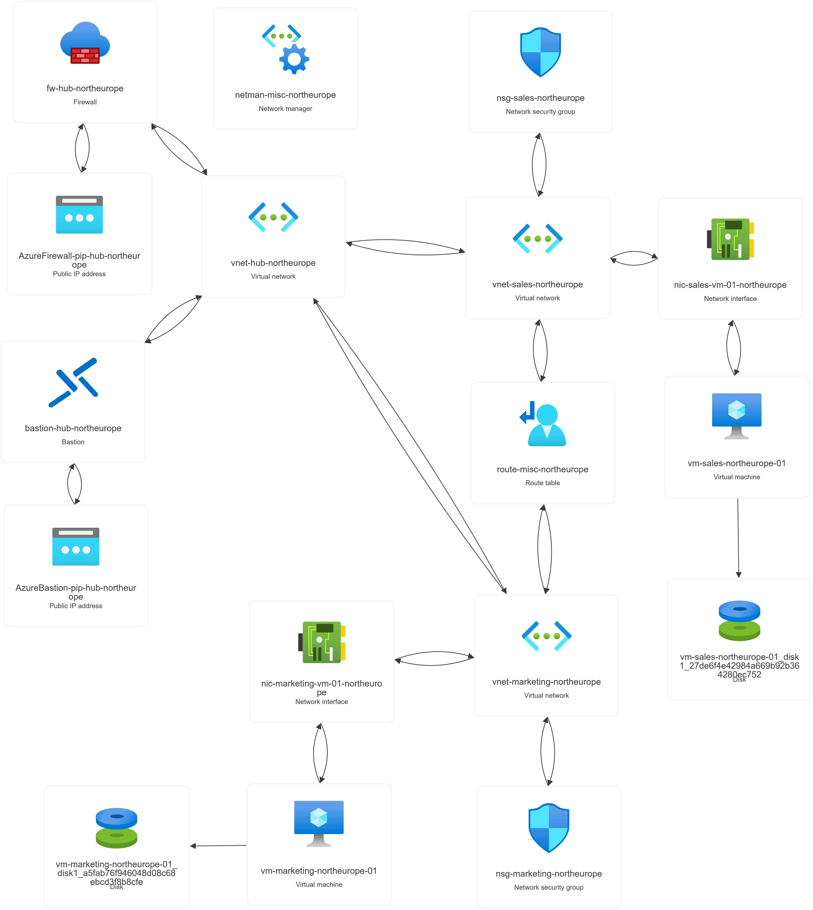

# Infrastructure-as-Code Deployment

This directory contains Terraform based IaC implementation for architectured hub-and-spoke network in Azure. Modules are not created to take into account all the possible configuration options, they include only those that are required for designed architecture. 

The goal of this project is to provide reusable, readable and extensible baseline for future projects.

This document contains configuration highlights.

## Configuration highlights

### Assumptions & Constraints

Many if not all resources are linked together with "env_key" that MUST match

Env_keys are based on resource group where resources will be deployed or where they are located.

For example in this Hub-and-Spoke topology configuration, all resources that belong to rg-hub, are under a key of "hub"

### Virtual Networks

- Supports creation of multiple Virtual Networks
- Each network can contain one or many subnets
    - Networks with zero subnets are not supported nor tested

### Network Manager

- Supports creation of multiple Network Managers
- Each network manager can have one or many groups, connectivity and deployment configurations

### Route Table

- Supports creation of multiple Route Tables
- Each table can have one or many routing rules
    - Tables with zero routes are not supported nor tested
- Each table can have one or many subnet associations 
    - Tables with zero associations are not supported nor tested

### Azure Firewall

- Supports creation of multiple Azure Firewall
- Each firewall can have one or many application and network collections
- Each collection supports one or many rules
    - Collections with zero rules are not supported nor tested
- Each firewalls "public_ip" attribute MUST have a same value as targeted public ip addresses key

### Azure Bastion

- Supports creation of multiple Azure Bastions
- Each bastions "public_ip" attribute MUST have a same value as targeted public ip addresses key 

### Public IP

- Supports creation of multiple Public IP Addresses
- Each address MUST have a same key as targeted resources "public_ip" attribute value, e.g. Azure Bastion or Azure Firewall.

### Network Security Groups

- Supports creation of multiple Network Securit Groups
- Each nsg can have one or many rules
- Support for subnet association has been implemented
- Support for Network Interface Card association has not been implemented because of architecture design

### Network Interfaces

- Supports creation of multiple Network Interfaces
- Each interface MUST have a same key as targeted virtual machine

### Virtual Machines

- Supports creation of multiple **Windows** based Virtual Machines
- **Linux** based Virtual Machines were not used as part of this project
- Each virtual machine MUST have a same key as targeted network interface

## Deployed environment

