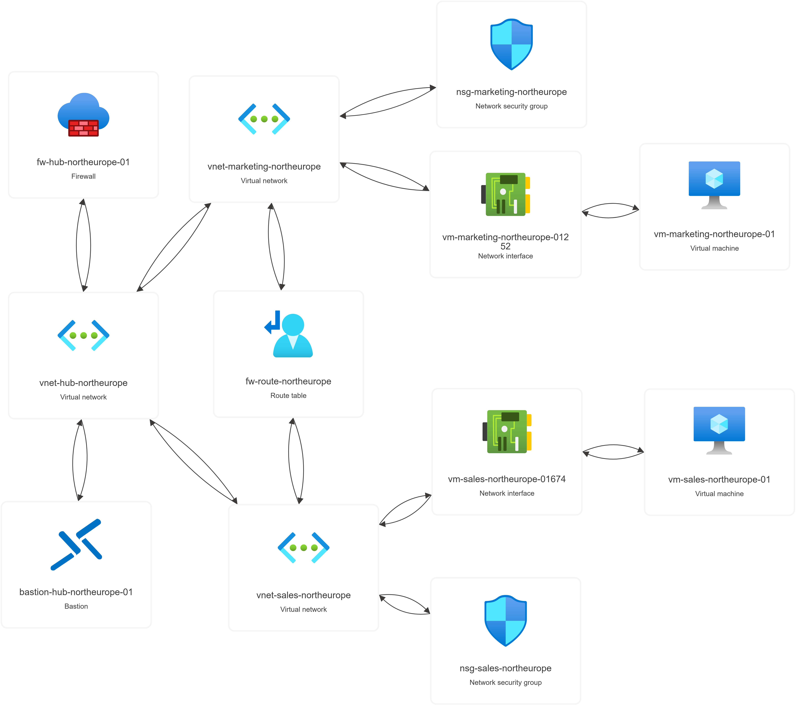

# Manual Deployment

This document describes the manual deployment process using the Azure Portal or CLI, summary of deployment steps and key configuration highlights. 

## Deployment order

Summary of deployment steps:
1. Create and configure **virtual networks** (hub and spoke(s))
2. Create and configure **network manager**, deploy hub-and-spoke topology configuration
3. Create, configure and associate **network security groups** to subnets
4. Create inbound rule to allow RDP
5. Create **Azure Bastion**
6. Create **virtual machines** in spoke networks
7. Create, configure and associate **route table**
8. Create and configure **Azure Firewall**

Screenshots in [screenshots/](screenshots/) capture the order in which resources were deployed and/or configured.

## Key configuration highlights

### Virtual network

- Custom DNS configuration

### Azure Firewall

- Deployed in AzureFirewallSubnet
- Network and application rules
    - DNS on port 53, servers same as configured on VNets
    - Allow/deny destinations

### Route table

- Default gateway route to firewall
    - 0.0.0.0/0 -> Azure Firewall private IP
- Associate only with workload subnets

### Network security groups

- Allow SSH/RDP access

## Deployed environment

