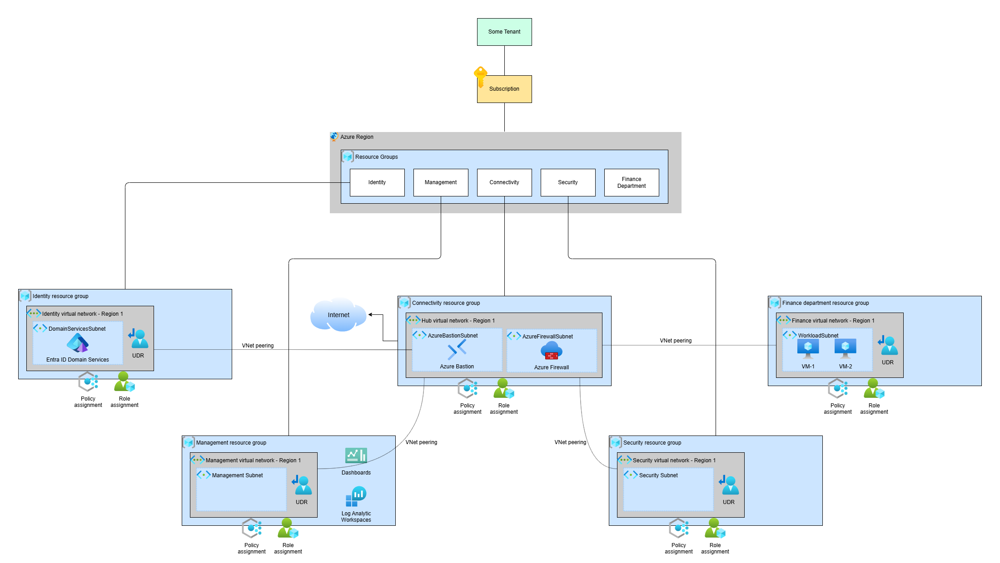

# Architecture

## Components

### Tenant

Represents the Azure tenant for the organization

### Subscription

Organizational unit. Can be turned into Management Group in enterprise scale implementations

### Resource Group

Organizational unit for related resources. Can be turned into Subscription(s) in enterprise scale implementations

### Virtual Network

Hub-and-spoke network pattern where traffic is centralized through shared services

### Policy Assignment

Resource rule enforcement. Applied at resource group level in this design. Could be applied at management group or subscription level in enterprise scale implementations

### Role Assignment

Role Based Access Control defining who can do what and at which scope. Applied at resource group level in this design. Could be applied at management group or subscription level in enterprise scale implementations

## Architecture Decision Records

Architectural decision records are recorded to preserve context of architectural choices. These will be written in the format proposed in a
[blog post by Michael Nygard](http://thinkrelevance.com/blog/2011/11/15/documenting-architecture-decisions)

List of ADRs are in [architecture-decisions-records directory](architecture-decision-records/).

### Tooling

[adr-tools](https://github.com/npryce/adr-tools) is used to help manage the decisions.

Use this tool only in the project folder

#### Initialization

`adr init ./architecture/architecture-decision-records`

#### Record new decision

`adr new 'Decision to record'`