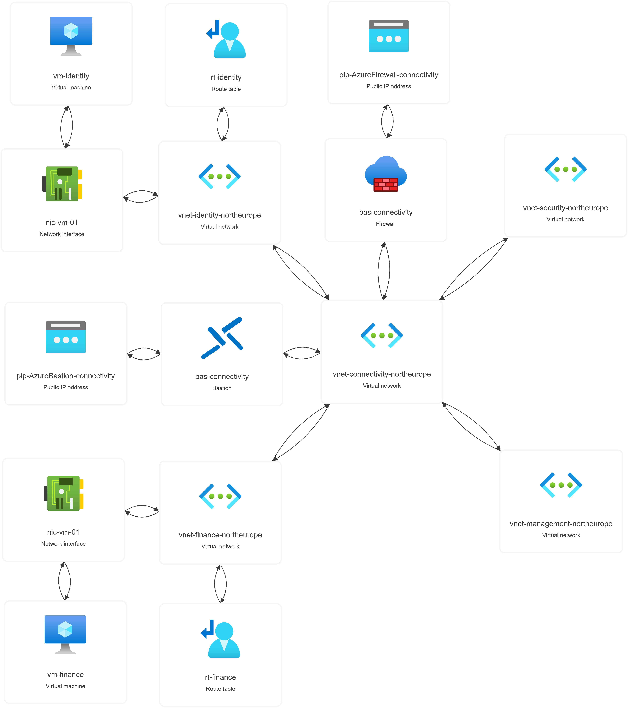

# Infrastructure-as-Code Deployment

This directory contains Terraform based IaC implementation for architectured Landing Zone in Azure. Modules are not created to take into account all the possible configuration options, they include only those that are required for designed architecture. 

The goal of this project is to provide reusable, readable and extensible baseline for future projects.

This document contains configuration highlights.

## Configuration highlights

### Assumptions & Constraints

Many if not all resources are linked together with "env_key" that MUST match

Env_keys are based on resource group where resources will be deployed or where they are located.

For example in this Landing Zone configuration, all resources that belong to rg-connectivity, are under a key of "connectivity".

Resources that support tags, will try to use tags definied for the variable. If that doesn't work, resource group tags will be used. If those doesn't exist, then tags for the module wil be used.

### Modules

#### AD Groups

- Features:
    - AD Group Creation
    - Role Assignments
- Supports creation of multiple AD Groups and role assingments
- Each group can have one or many role assignments
- Supports multiple role assignments for subscription and resource groups only

#### Networks

- Supports creation of multiple virtual networks and networks peerings, targeting hub-and-spoke configuration
- Each network can have one or many subnets
- Peerings assume that environments with key "connectivity" or "hub" will be used as a hub, rest are used as a spoke networks

#### Policy Definitions

- Supports creation of multiple policy definitions
- Policies are read from [policy-definition](terraform/policy-definition) directory
- New policies and their file names must be added in [policyname.csv](terraform/policy-definition/def-policy-csv/policyname.csv)

#### Resource Groups

- Supports creation of multiple resource groups

#### Route Tables

- Supports creation of multiple Route Tables
- Each table can have one or many routing rules
    - Tables with zero routes are not supported nor tested
- Each table can have one or many subnet associations 
    - Tables with zero associations are not supported nor tested

#### Shared Services

- Features: 
    - Public IP Addresses for shared services
    - Azure Bastion
    - Azure Firewall
- Supports creation of multiple Azure Bastions and Firewalls
- Service "pip" attribute must match the public ip configurations key value

#### Virtual Machines

- Features:
    - Network Interface creation
    - Linux based Virtual Machine creation
- Supports creation of multiple Network Interfaces and **Linux** based Virtual Machines. **Windows** based Virtual Machines were not used as part of this project
- Keys for **Network Interfaces** and **Virtual **Machines** must match

## Deployed environment

