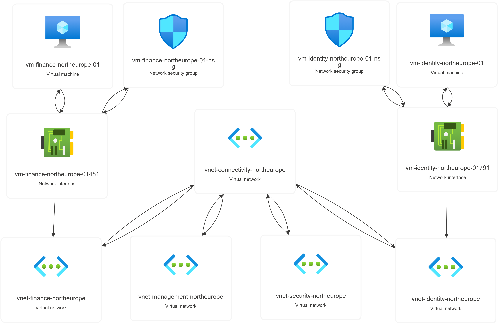

# Manual Deployment

This document describes the manual deployment process using the Azure Portal or CLI, summary of deployment steps and key configuration highlights. 

PowerShell automation is used for repetitive deployments such as:
- Creating AD groups and assigning permissions
- Creating resource groups
- Creating virtual networks and network peerings

## Deployment order

Summary of deployment steps:
1. Create **AD groups** data object and use `createAdGroups` function to create the groups
2. Create **resource groups** data object and use `createResourceGroups` function to create the groups 
3. Use **AD groups** data object and use `assignPermissions` function to assign permissions to scopes 
4. Create **virtual networks** data object and use `createVirtualNetworks` function to create the networks
5. Use **virtual networks** data object and use `createHubAndSpoke` function to create network peerings 

Screenshots in [screenshots/](screenshots/) capture the order in which resources were deployed and/or configured.

## Key configuration highlights

Data objects and resource name prefixes used in this project are stored in [constants](powershell-scripts/constants.ps1) file

Automation scripts utilize [helper scripts](powershell-scripts/helpers.ps1) which must be loaded for functions to work correctly.

Existing resources found by name and their resource id will be skipped but full verification is not guaranteed.

Resource group name and virtual network name must match for association logic to work.

### Resource group name prefix

- Variable name must be `$RESOURCE_GROUP_PREFIX`

### Virtual network name prefix

- Variable name must be `$VNET_PREFIX`

### AD groups data object

Data object must follow the following format:
```
@(
    @{
        displayName
        mailNickname
        permission_assignments @{
            scope
            permissions @()
        }
    }
)
```

### Resource groups data object

Data object must follow the following format:
```
@(
    @{
        name
        location
        (optional) tags @{
            tag 1
            tag 2
            ...
        }
    }
)
```

### Virtual networks data object

Data object must follow the following format:
```
@(
    @{
        name
        address_prefix
        network = hub/spoke
        (optional) tags @{
            tag 1
            tag 2
            ...
        }
    }
)
```

## Deployed environment

